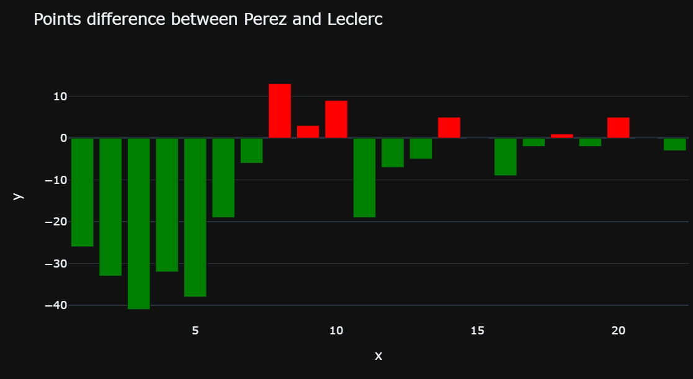
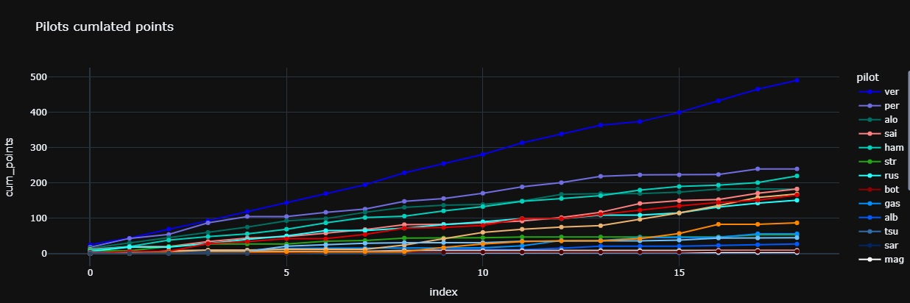
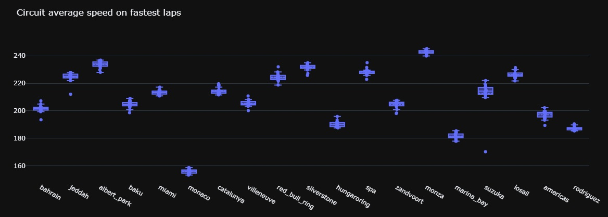

# Formula 1 data analysis application

This is a project that aims to learn to do some datascience on real project et doing a maximum of different tasks
It will help me to do a real project and to link two of my passions, so I can stay on this project for a long time

## 2022

It is the first season I do. I searched an interesting data source, I scrap these data, do some processing and then make a visualisation and an analyse.

I made the graphs and charts that seems interesting for these data and I've added some updates during the year

Unfortunately, some of the data and graphs are useless because they depend too much on the circuit (speed and lap time).

End of 2022, I started thinking of what I want to do for the 2023 season and which would be better than what I did on the previous season.

It allowed me to do some plans with the avalaible data, the graphs and charts adapted and the processing I have to do

## 2023

For this year, I have prepared the charts, the upgrades, I did some design. This time, I start the season prepared.

At the start of the season I was very hyped. I liked seeing the different charts filling but along the year.

But after that, I realized that many of these charts where useless, And having to update all charts every time was very boring.

I didn't even updates the charts on the lasts Grand Prix.

## 2024

For the 2024 season, I learn from my mistakes. I'll do something more simple using a python code instead of a notebook.

It worked perfeclty, until the middle of the season, when my data source didn't provide the data anymore, and I stopped using this app for the remaining races of the year

## 2025

This time, I want to try using FastF1 python library for livetiming data.

more global season data like points will be scrapped from internet
